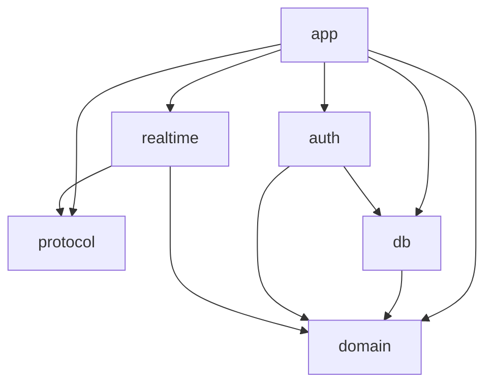

# Architecture overview

How the code is divided, and which way the divisions may depend on each other.

## Crates

| Crate | Responsibility | Must not |
|---|---|---|
| `protocol` | The wire format: frames and their serialisation | Know about storage, or depend on any type from `domain` |
| `domain` | Types and rules: organization, team, channel, message, authorization | Know how anything is stored or transmitted |
| `db` | Persistence. **The only place that writes SQL** | Be bypassed: callers do not write SQL, and organization-scoped reads go through here |
| `auth` | Authentication, sessions, invite tokens | Store or log a token in plaintext |
| `realtime` | Subscriptions and fan-out | Expose a `tokio` channel type, or its lag error, in its public API |
| `app` | The binary: wiring, configuration, shutdown | — |

Each library crate's `//!` documentation says the same, so the boundary is
visible from the code as well. `app` is the binary and has none.

## Dependency direction

`protocol` and `domain` depend on nothing in this workspace.

**The direction is declared in the manifests, and cargo enforces only part of
it.** Cargo rejects a cycle, so *reversing an existing edge* fails to build —
`domain` depending on `db`, for example, because `db` already depends on `domain`.

**Cargo does not reject a new edge that forms no cycle.** `domain` depending on
`protocol` builds without complaint, and is still forbidden. Those are caught in
review until a test checks the dependency graph against this one (#21).

## Where types are documented

**In rustdoc, not here.** A list of important types in Markdown is the fastest
document to fall behind the code. `cargo doc --open` is the reference.

## Request flow

**Not written yet.** The only route today is `/health`, which touches nothing.
This section is filled in when messages are sent and received (#6) — describing
the flow before it exists would describe code nobody has written.

## Where things are decided

| What | Where |
|---|---|
| Rules that must always hold | [`invariants.md`](invariants.md) |
| Who may see and do what | [`../security/authorization-model.md`](../security/authorization-model.md) |
| What words mean | [`../domain/glossary.md`](../domain/glossary.md) |
| Work in progress, what is next | GitHub issues |
